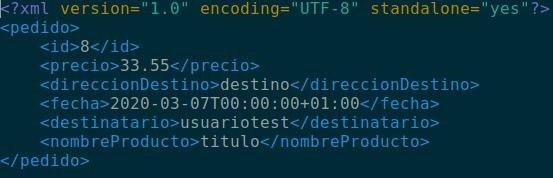

# ProyectoDADServicioInternoGeneradorPDF
Servicio interno de Proyecto Marketplace que genera facturas en PDF.

Sigue el siguiente esquema de funcionamiento:
- La aplicación se concecta mediante socket TLS al Servicio Interno y le envía un id del Pedido del que necesita la factura.
- El servicio interno recibe la petición y busca en la base de datos un Pedido con el id recibido.
- Crea un nuevo objeto Pedido (distino al de la aplicación) que solo tiene los datos necesarios para generar la factura.
- A partir de este objeto se genera un XML con los atributos necesarios.
- A partir de este XML, aplicando unas reglas de estilo definidas en un archivo XLS, genera el PDF.
- Este PDF se envía de vuelta al cliente.
- Por último, el servicio interno debería eliminar tanto el PDF como el XML para ahorrar espacio en disco.

#### Concurrencia:
Debido a que el Servicio Interno debe poder atender múltiples peticiones, se debe de generar un nuevo hilo con cada petición que llegue. Para ello se una una Thread Pool, que limita el número de hilos que pueden estar en ejecución simultaneamente. Se ha decidido poner este límite debido a que si llegan demasiadas peticiones (pongamos 10000), la aplicación tardaría demasiado en atender cada petición. Poniendo un límite razonable es posible que un usuario en un momento dado no pueda generar un PDF, pero por norma general, se da mejor servicio al cliente.

### Ejemplo de XML generado:

### Ejemplo de PDF generado:

